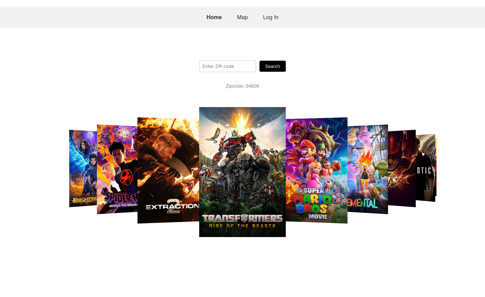

# PEARFECT PAIR

## Installation

To run it locally, clone the repo via the link below under Links. In your terminal, enter npm i to install inquirer once you are in the correct folder. Next, enter npm start to initiate the application. Open your web browser and go to http://localhost:3001/ to view the app. 

## Usage

Once you are on the home page (it should show a webpage with a nav bar and a movie carousel). As a user, you can sign up and create an account that will log your information and history of the restaurants and movies you've picked. Once back at the homepage, you will enter your zipcode and once click on a movie card from the carousel that will open up the feature page which will populate the movie's information and a map showing the restaurants around the theater based on the zip code input on the previous page. 

## License
ISC

## Links

Github Repo: https://github.com/orngmrmld/project-2
Heroku Link: https://perfect-pear-2-cb65697bbf0a.herokuapp.com/

## Web Page Snippet

